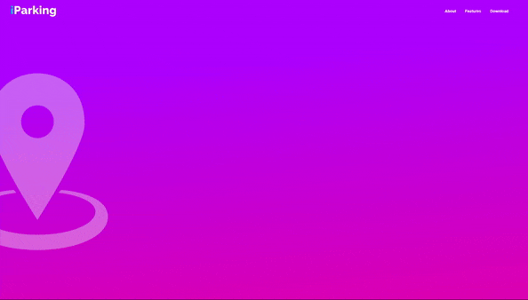

<!-- PROJECT LOGO -->
 

  

  <h3 align="center">iParking Web</h3>

  

    A web marketing interface for the iParking app!
  

<!-- ABOUT THE PROJECT -->
## About The Project

  

A web application for users who want to know more about the iParking mobile app.

### Sections

* Home
* About the App
* Features
* Download

### Built With

* [React](https://reactjs.org)
* [HTML](https://www.w3schools.com/html/html_intro.asp)
* [CSS](https://www.w3schools.com/css/css_intro.asp)
* [CSS Animations](https://www.w3schools.com/css/css3_animations.asp)

<!-- CONTACT -->
## Contact

Milton Boos Junior - miltonboosj@gmail.com

Project Link: [https://github.com/juniorboos/iParkingWeb](https://github.com/juniorboos/iParkingWeb)

